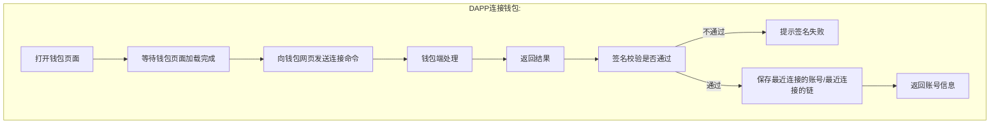
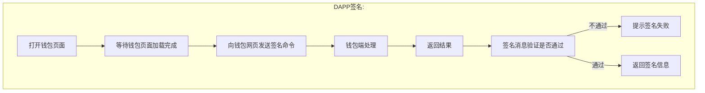
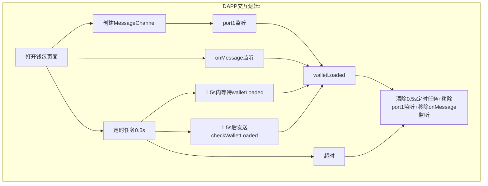

DAPP连接钱包

```mermaid
graph TD
subgraph DAPP连接钱包:
打开钱包页面 --> 等待钱包页面加载完成 --> 向钱包网页发送连接命令 --> 钱包端处理 --> 返回结果 --> 签名校验是否通过
签名校验是否通过 -- 不通过 --> 提示签名失败
签名校验是否通过 -- 通过 --> 保存最近连接的账号/最近连接的链 --> 返回账号信息
end
```

DAPP签名

```mermaid
graph TD
subgraph DAPP签名:
打开钱包页面 --> 等待钱包页面加载完成 --> 向钱包网页发送签名命令 --> 钱包端处理 --> 返回结果 --> 签名消息验证是否通过
签名消息验证是否通过 -- 不通过 --> 提示签名失败
签名消息验证是否通过 -- 通过 --> 返回签名信息
end
```

DAPP交互逻辑

```mermaid
graph TD
subgraph DAPP交互逻辑:
打开钱包页面 --> 创建MessageChannel --> port1监听 --> walletLoaded
打开钱包页面 --> onMessage监听 --> walletLoaded
打开钱包页面 --> 定时任务0.5s
定时任务0.5s --> 1.5s内等待walletLoaded --> walletLoaded
定时任务0.5s --> 1.5s后发送checkWalletLoaded --> walletLoaded
定时任务0.5s --> 超时 --> 清除0.5s定时任务+移除port1监听+移除onMessage监听
walletLoaded --> 清除0.5s定时任务+移除port1监听+移除onMessage监听
end
```
