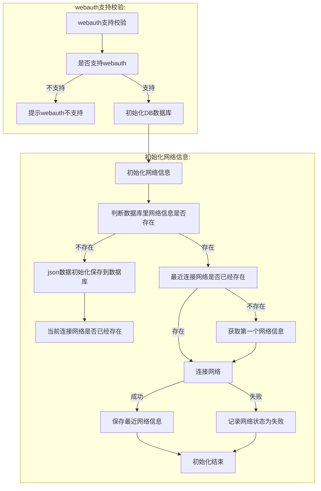
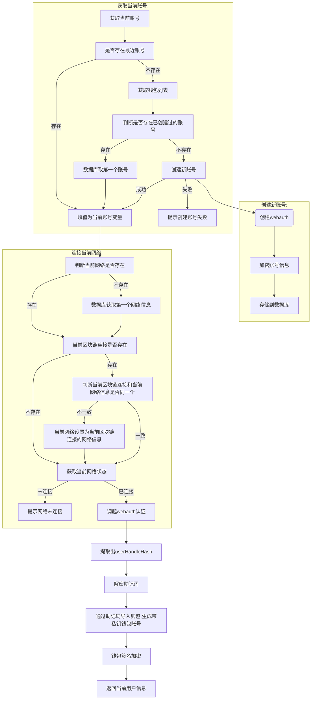
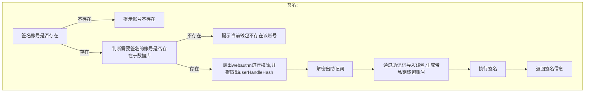
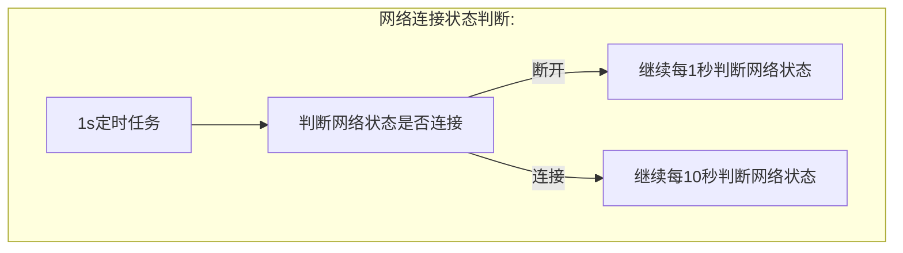

钱包初始化

```mermaid
graph TD
webauth支持校验
subgraph webauth支持校验:
webauth支持校验 --> 是否支持webauth
是否支持webauth -- 不支持 -->提示webauth不支持
是否支持webauth -- 支持 --> 初始化DB数据库
end

初始化DB数据库 --> 初始化网络信息

subgraph 初始化网络信息:
初始化网络信息 --> 判断数据库里网络信息是否存在
判断数据库里网络信息是否存在 -- 不存在 --> json数据初始化保存到数据库 --> 当前连接网络是否已经存在
判断数据库里网络信息是否存在 -- 存在 --> 最近连接网络是否已经存在
最近连接网络是否已经存在 -- 存在 --> 连接网络
最近连接网络是否已经存在 -- 不存在 --> 获取第一个网络信息 --> 连接网络
连接网络 -- 成功 --> 保存最近网络信息 --> 初始化结束
连接网络 -- 失败 --> 记录网络状态为失败 --> 初始化结束
end

```

连接钱包

```mermaid
graph TD
subgraph 获取当前账号:
获取当前账号 --> 是否存在最近账号
是否存在最近账号 -- 存在 --> 赋值为当前账号变量
是否存在最近账号 -- 不存在 --> 获取钱包列表 --> 判断是否存在已创建过的账号
判断是否存在已创建过的账号 -- 存在 --> 数据库取第一个账号 --> 赋值为当前账号变量
判断是否存在已创建过的账号 -- 不存在 --> 创建新账号
创建新账号 -- 成功 --> 赋值为当前账号变量
创建新账号 -- 失败 --> 提示创建账号失败
end

subgraph 创建新账号:
创建新账号 --> 注册新的Passkey(创建webauth) --> 加密账号信息 --> 存储到数据库
end

subgraph 连接当前网络:
赋值为当前账号变量 --> 判断当前网络是否存在
判断当前网络是否存在 -- 存在 --> 当前区块链连接是否存在
判断当前网络是否存在 -- 不存在 --> 数据库获取第一个网络信息 --> 当前区块链连接是否存在
当前区块链连接是否存在 -- 不存在 --> 获取当前网络状态
当前区块链连接是否存在 -- 存在 --> 判断当前区块链连接和当前网络信息是否同一个
判断当前区块链连接和当前网络信息是否同一个 -- 不一致 --> 当前网络设置为当前区块链连接的网络信息 --> 获取当前网络状态
判断当前区块链连接和当前网络信息是否同一个 -- 一致 --> 获取当前网络状态
获取当前网络状态 -- 未连接 --> 提示网络未连接
获取当前网络状态 -- 已连接 --> 调起webauth认证
end


调起webauth认证 --> 提取出userHandleHash --> 解密助记词 --> 通过助记词导入钱包,生成带私钥钱包账号 --> 钱包签名加密 --> 返回当前用户信息
```

签名

```mermaid
graph TD
subgraph 签名:
签名账号是否存在 -- 不存在 --> 提示账号不存在
签名账号是否存在 -- 存在 --> 判断需要签名的账号是否存在于数据库
判断需要签名的账号是否存在于数据库 -- 不存在 --> 提示当前钱包不存在该账号
判断需要签名的账号是否存在于数据库 -- 存在 --> 调出webauthn进行校验,并提取出userHandleHash --> 解密出助记词 --> 通过助记词导入钱包,生成带私钥钱包账号 --> 执行签名 --> 返回签名信息
end
```

网络连接状态判断

```mermaid
graph TD
subgraph 网络连接状态判断:
1s定时任务 --> 判断网络状态是否连接
判断网络状态是否连接 -- 断开 --> 继续每1秒判断网络状态
判断网络状态是否连接 -- 连接 --> 继续每10秒判断网络状态
end
```
