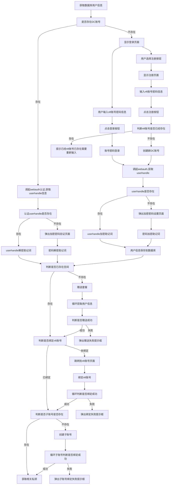

dclogin 账户流程

```mermaid
graph TD
获取数据库用户信息 --> 是否存在DC账号
是否存在DC账号 -- 存在 --> 调起webauth认证,获取userhandle信息 --> 认证userhandle是否存在
认证userhandle是否存在 -- 存在 --> userhandle解密助记词 --> 判断是否已存在空间
认证userhandle是否存在 -- 不存在 --> 弹出加密密码验证页面 --> 密码解密助记词 --> 判断是否已存在空间
判断是否已存在空间 -- 存在 --> 判断是否绑定nft账号 -- 已绑定  --> 判断是否子账号是否存在
判断是否绑定nft账号 -- 未绑定 --> 跳转到nft账号页面 --> 绑定nft账号 -->
循环判断是否绑定成功 -- 失败 --> 弹出绑定失败提示框
循环判断是否绑定成功 -- 成功 --> 判断是否子账号是否存在
判断是否子账号是否存在 -- 存在 --> 获取相关私钥
判断是否子账号是否存在 -- 不存在 --> 创建子账号 --> 循环子账号判断是否绑定成功
循环子账号判断是否绑定成功 -- 成功 --> 获取相关私钥
循环子账号判断是否绑定成功 -- 失败 --> 弹出子账号绑定失败提示框
判断是否已存在空间 -- 不存在 --> 赠送套餐 --> 循环获取用户信息 --> 判断是否赠送成功 -- 成功 --> 判断是否绑定nft账号
判断是否赠送成功 -- 失败 --> 弹出赠送失败提示框
是否存在DC账号 -- 不存在 --> 显示登录页面
显示登录页面 --> 用户输入nft账号密码信息 --> 点击登录按钮 --> 账号密码登录 --> 调起webauth,获取userhandle
显示登录页面 --> 用户选择注册按钮 --> 显示注册页面
显示注册页面 --> 输入nft账号密码信息 --> 点击注册按钮 --> 判断nft账号是否已经存在
判断nft账号是否已经存在 -- 存在 --> 提示已经nft账号已存在需要重新输入
判断nft账号是否已经存在 -- 不存在 --> 创建新DC账号 --> 调起webauth,获取userhandle --> userhandle是否存在
userhandle是否存在 -- 存在 --> userhandle加密助记词 --> 用户信息保存到数据库
userhandle是否存在 -- 不存在 --> 弹出加密密码设置页面--> 密码加密助记词 --> 用户信息保存到数据库 --> 判断是否已存在空间
```
